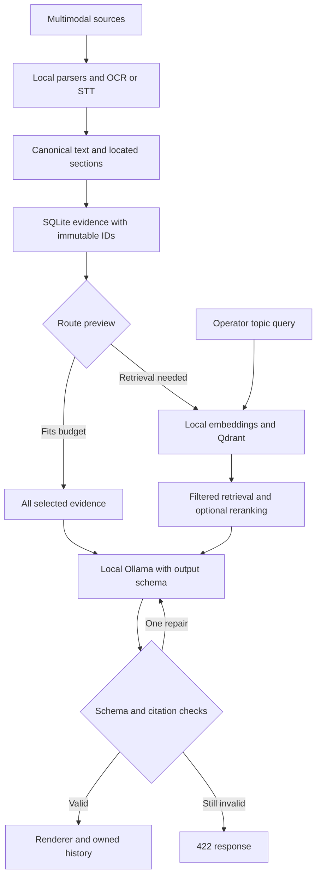
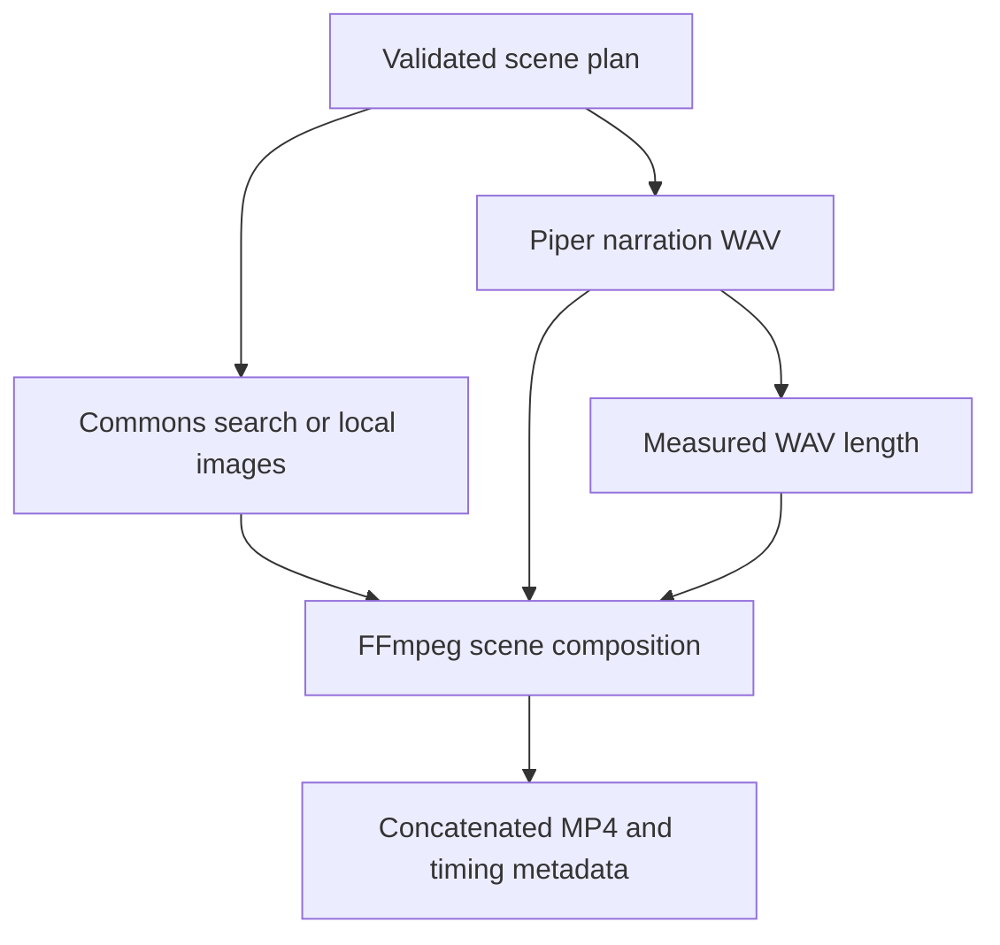

# Architecture

The supplied Python package and API layout are retained. The original SQLite
keyword retrieval is replaced with a local semantic index. SQLite remains the
source of truth for ownership, evidence and generated history.

## Input contracts

`parse_file` returns canonical text, summary metadata and an ordered list of
sections. Each section contains `text` and applicable location fields. PDF OCR
happens in page order; DOCX paragraphs/tables retain body order; spreadsheets
repeat column labels per row; audio/video preserve transcript segment times.
`chunk_sections` never joins separate page/sheet/time blocks. Backend-generated
IDs are stored in SQLite and reused for DIRECT and RAG. Immutable evidence is
not re-chunked during retrieval, preserving existing citations.

Raw uploads are temporary. SHA-256 is calculated over original bytes before
parsing; the canonical text, hash, metadata and chunks are retained. URL imports
hash received response bytes. Text inputs hash their UTF-8 encoding. PDF and
Office parsing limits are configurable but are not a substitute for sandboxing.

## Route and model boundaries

`api/route.py` previews the same decision used by `api/transform.py`. Token
estimates include serialized evidence metadata and overlap. Explicit retrieval
and persistent-knowledge flags take precedence, followed by document count and
size. A topic query influences only the RAG route. For topic-focused work on a
small source, enable Force RAG.

Qdrant indexing is lazy, with deterministic UUID point IDs and batched upserts.
A model-name fingerprint selects the collection. Every vector operation uses a
tenant/source filter. Query results are validated against canonical SQLite
records. In local mode a process-wide lock protects embedded client operations;
run one Uvicorn worker. Server mode allows a separately managed trusted service.

Each output type has a separate Pydantic contract and format prompt. The model
receives source data marked as untrusted, operator controls, allowed citation IDs
and the schema. No model response is executed. Generation makes at most two
Ollama calls per output. Repair feedback contains validation errors without
re-sending an invented answer as evidence.

Verification means schema/citation identity checks, plus a narrow lexical check
for advisory severity. It does not entail claim-level truth verification. The API
states `factual_accuracy_verified=false` and the UI requires human review.

## Video composition

The renderer searches Commons with bounded visual keywords in public/auto mode,
screens license metadata and retains credits; local filenames/tags and caption
cards are fallbacks. It draws captions,
measures narration duration and composes each scene. Paths and process arguments
are backend-controlled; temporary work directories are unique and cleaned up.
The MP4 timeline is subject to frame/audio packet quantization. No text-to-video
model, VLM or browser-based fact checker is present. Public images are illustrations,
not factual evidence. Internal outputs disable image search and external publishing.

## Storage and API consistency

The existing `users`, `sources`, `evidence`, `assets`, `audit_events` tables are
retained; startup adds indexes and `connections`/`publications` tables without destructive migrations. Old evidence that
lacks location metadata remains readable but cannot recover locations that the
old parser discarded. Re-ingest originals to obtain richer provenance. Older
assets without the new strict schema should be regenerated if their display is
incomplete. The uploaded ZIP contained no database requiring migration.

Each successful generation receives a unique file and asset row. Format failures
are reported independently; completed formats remain in history. Detail and
text-download requests regenerate signed citation URLs rather than preserving
expired JWTs. The browser uses only same-origin assets and keeps access tokens
in memory. Reload requires login again.

## Extension boundaries

Future VLM ingestion can emit the same section records with frame/timestamp
metadata. External publishing now uses an explicit preview-and-submit API for
LinkedIn text, X threads and SMTP email. Per-user connector secrets are encrypted.
Preview tokens bind the exact payload and destination; durable fingerprints block
double submits and thread IDs are checkpointed. Unknown delivery is not retried.

Manual editing and separate lightweight-model revisions create new asset rows,
retain the parent ID and reuse only the original generation's owned evidence.
Deleting selected versions removes their files and metadata, retaining minimal
submission/audit receipts. Sources referenced by surviving outputs cannot be deleted.

Per-process model backpressure is implemented. Production scaling still requires
a durable job queue, distributed controls, protected Qdrant server mode and model
services. The current account system provides ownership isolation, not RBAC.
